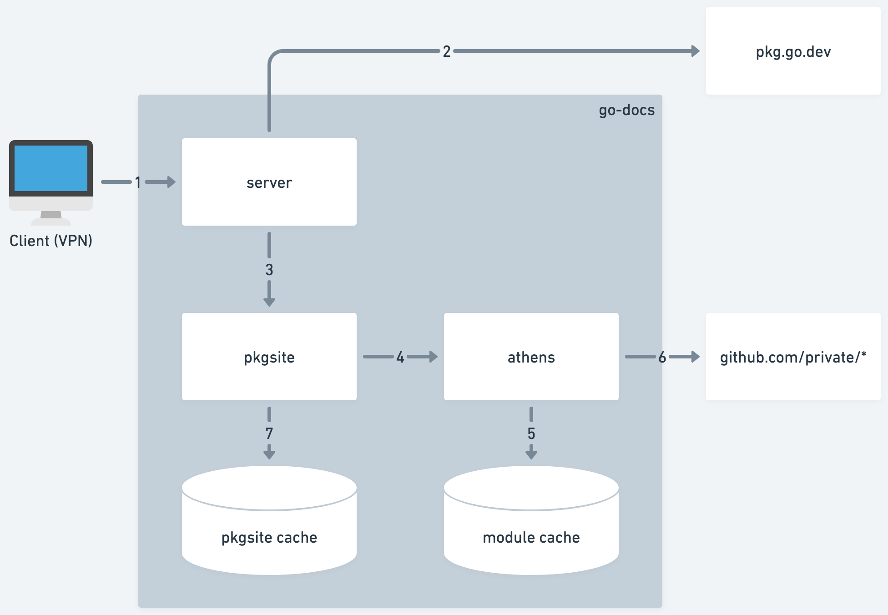

# System Diagram



## Components

### Server

The front-facing server (`localhost:8080`) routes requests based on their path. Internal module paths are expected to be prefixed with `github.com/private/`, while all other module paths are considered external.

All external module paths are forward proxied to https://pkg.go.dev. Fetching, storing, and generating go doc pages for publicly accessible modules is unnecessary and incurs a heavy latency hit when loading the page. This includes any links from an internal go document to an external or std package (check out https://go.dev/doc/comment#links).

Internal module paths are redirected to the locally running `pkgsite` container.

### Pkgsite

source: https://go.googlesource.com/pkgsite

The `pkgsite` container (`localhost:8888`) generates the go doc page using the go team's open-sourced code.

Key configuration details to note are:
 - `proxy_url`: Tells `pkgsite` to call the local `athens` endpoint instead of the default `https://proxy.golang.org` when fetching module data. See [GOPROXY](#goproxy) for more details.
 - `GO_DISCOVERY_REDIS_HOST`: We bundle `pkgsite` with a cache implementation (in this case, locally running Redis) in order to not re-render doc pages, which can take a while especially for larger repos.

### Athens

source: https://github.com/gomods/athens

The `athens` container (`localhost:3000`) acts as a proxy server that caches go module data.

Key configuration details to note are:
 - `ATHENS_STORAGE_TYPE`: Tells `athens` to store module data locally. This can be updated to use other storage services: https://docs.gomods.io/configuration/storage/
 - `ATHENS_GONOSUM_PATTERNS`: Skips checksum request to https://sum.golang.org. See [GONOSUMDB](#gonosumdb) for more details.
 - This container uses the `.netrc` file generated at the image's build time to access private repositories

## Request Flow

User Jonathan wants to view go docs for:
 - internal module path: `github.com/private/go-module`
 - external module path: `github.com/external/go-module`
 - std library module path: `net/http`

1. Jonathan (on company VPN range) visits `endpoint-that-you-set-up-for-go-docs-server.com` + module path
 - In this example, `endpoint-that-you-set-up-for-go-docs-server.com/github.com/private/go-module`
2. For paths that are not internal (ex. `/net/http` or `/github.com/external/go-module`), forward request to https://pkg.go.dev/
3. For paths that are internal (ex. `/github.com/private/go-module`), request the doc page from internal `pkgsite` container
4. `pkgsite` container fetches module data for `github.com/private/go-module@latest` from the `athens` proxy container
5. `athens` returns module data from cache if that version is found
6. Otherwise, `athens` loads the module data from github, stores it in cache, and returns it to `pkgsite` to render
7. `pkgsite` returns the rendered page for the requested module if it exists in cache. Otherwise it renders the page, caches it, and returns it

# Go Modules

For in-depth documentation on go modules check out https://go.dev/ref/mod. The two go module topics pertinent to this project are the [module proxy](https://go.dev/ref/mod#module-proxy) and the [checksum db](https://go.dev/ref/mod#checksum-database).

## GOPROXY
By default, when you fetch go modules with the go command, it will first go to a closed-source proxy server owned by Google before falling back to directly requesting the repository. This behavior can be configured with the go env variable `GOPROXY`.

```
> go env
...
GOPROXY='https://proxy.golang.org,direct'
...
```

Go defines a [protocol](https://go.dev/ref/mod#goproxy-protocol) that allows users to host private modules on their own servers - the open-source [athens](https://docs.gomods.io/) project used in the [athens](#athens) component implements this proxy protocol.

## GONOSUMDB
By default, the go command tries to authenticate every downloaded module, ensuring that the bits associated with a specific version do not change from one day to the next, even if the module’s author subsequently alters the tags in their repository. This also ensures that proxy servers cannot serve the wrong code without it going unnoticed. Similar to the default proxy server, this checksum db is closed-sourced and owned by Google.

```
> go env
...
GOSUMDB='sum.golang.org'
...
```

For private repositories, the checksum db will not (and should not) be able to access any of the module data. This is why you cannot update go module information for private modules unless you set either the `GOPRIVATE` or `GONOSUMDB` environment variables. Both of these will bypass verification step against the checksum db (see https://go.dev/ref/mod#authenticating).

```
> go get github.com/private/myproject
github.com/private/myproject@v0.0.0-<checksum>: verifying module: github.com/private/myproject@v0.0.0-<checksum>: reading https://sum.golang.org/lookup/github.com/private/myproject@v0.0.0-<checksum>: 404 Not Found
    server response:
    not found: github.com/private/myproject@v0.0.0-<checksum>: invalid version: git ls-remote -q origin in /tmp/gopath/pkg/mod/cache/vcs/<checksum>: exit status 128:
        fatal: could not read Username for 'https://github.com': terminal prompts disabled
    Confirm the import path was entered correctly.
    If this is a private repository, see https://golang.org/doc/faq#git_https for additional information.
> GOPRIVATE=github.com/private go get github.com/private/myproject
go: upgraded github.com/private/myproject v0.0.0-<checksum> => v0.0.0-<checksum>
```